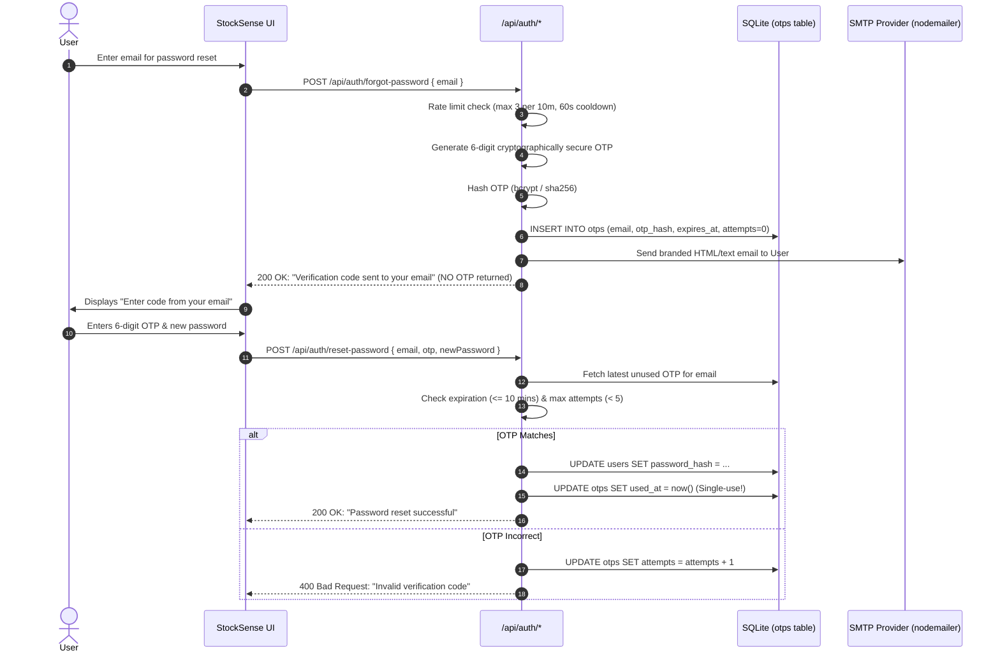

# StockSense — RBAC & Real Email OTP Upgrade Plan

Upgrade the existing StockSense application to replace cosmetic role handling with genuine, dual-layer Role-Based Access Control (RBAC) and replace developer-mode OTP with secure, production-grade email delivery.

## User Review Required

> [!IMPORTANT]
> - **Dual-Layer RBAC**: Authorization is enforced both on the client UI (hidden/customized components) and on the backend API (HTTP 401/403 errors). Warehouse Staff calling restricted endpoints will be rejected.
> - **Default Signup Role**: Public registration (`/signup`) automatically assigns `WAREHOUSE_STAFF`. No user can self-elevate to `INVENTORY_MANAGER`. Manager accounts are seeded (`manager@stocksense.com`, `admin@stocksense.com`) or assigned by an existing Manager.
> - **Real Email OTP Delivery**:
>   - Developer-mode OTP display is completely removed from the UI and console.
>   - OTP is generated cryptographically, hashed in the database (`otps` table), expires in 10 minutes, is single-use, has a 5-attempt limit, and is rate-limited against spam.
>   - SMTP email delivery is implemented using `nodemailer` with environment variables.
>   - If SMTP is unconfigured in development, the system displays a clear configuration alert: *"Email service is not configured. Configure the email environment variables to enable OTP delivery."*
>   - For automated testing, a test transport adapter is available to verify the full delivery and verification lifecycle.

---

## 1. Permissions & Access Control Matrix

| Feature / Resource | Permission | Inventory Manager | Warehouse Staff |
|---|---|:---:|:---:|
| **Dashboard** | `dashboard.view` | Full Management KPIs & Feed | Operational Floor Focus (Tasks, Moves, Alerts) |
| **Products List & Search** | `products.view` | Yes | Yes |
| **Create / Edit Products** | `products.manage` | Yes | **No (403 Forbidden)** |
| **Categories Management** | `categories.manage` | Yes | **No (403 Forbidden)** |
| **Reorder Rules / Min Stock** | `products.reorder` | Yes | **No (403 Forbidden)** |
| **Stock Availability by Location** | `stock.view` | Yes | Yes |
| **Receipts (Receive Stock)** | `receipts.view`, `receipts.operate` | Yes | Yes |
| **Delivery Orders (Pick & Deliver)**| `deliveries.view`, `deliveries.operate` | Yes | Yes |
| **Internal Transfers** | `transfers.view`, `transfers.operate` | Yes | Yes |
| **Create Stock Adjustment** | `adjustments.create` | Yes | Yes (Draft only) |
| **Validate Stock Adjustment** | `adjustments.validate` | Yes | **No (403 Forbidden - Manager only)** |
| **Move History Ledger** | `history.view` | Yes | Yes |
| **Warehouse Settings** | `warehouses.manage` | Yes | **No (Access Denied / 403)** |
| **Location Settings** | `locations.manage` | Yes | **No (Access Denied / 403)** |

---

## 2. Real Email OTP Lifecycle



---

## Proposed Changes

### Dependencies & Configuration
#### [MODIFY] [package.json](file:///c:/Projects/StockSense/package.json)
- Add `nodemailer` and `@types/nodemailer`.

#### [NEW] [.env.example](file:///c:/Projects/StockSense/.env.example)
- Document all environment variables (`EMAIL_HOST`, `EMAIL_PORT`, `EMAIL_USER`, `EMAIL_PASSWORD`, `EMAIL_FROM`, `EMAIL_SECURE`, `JWT_SECRET`).

#### [MODIFY] [.env.local](file:///c:/Projects/StockSense/.env.local)
- Add email configuration entries and test mode toggle.

---

### Backend: Database & Permissions
#### [NEW] [src/lib/rbac.ts](file:///c:/Projects/StockSense/src/lib/rbac.ts)
- Define `Role`: `'INVENTORY_MANAGER' | 'WAREHOUSE_STAFF'`.
- Define `Permission` enum / string union.
- Mapping of roles to permissions.
- Helper functions: `hasPermission(role, permission)`, `assertPermission(role, permission)`.

#### [MODIFY] [src/lib/db.ts](file:///c:/Projects/StockSense/src/lib/db.ts)
- Add `otps` table:
  ```sql
  CREATE TABLE IF NOT EXISTS otps (
    id TEXT PRIMARY KEY,
    user_id TEXT,
    email TEXT NOT NULL,
    otp_hash TEXT NOT NULL,
    expires_at INTEGER NOT NULL,
    attempts INTEGER NOT NULL DEFAULT 0,
    used_at INTEGER,
    created_at INTEGER NOT NULL
  );
  ```
- Normalize `users.role` to `'INVENTORY_MANAGER'` and `'WAREHOUSE_STAFF'` (with backward compatibility for existing `'manager'` / `'staff'`).

#### [NEW] [src/lib/email.ts](file:///c:/Projects/StockSense/src/lib/email.ts)
- Email delivery provider abstraction using `nodemailer`.
- Transports: SMTP transport and Mock/Test transport.
- Clean error if SMTP is not configured in local environment.

#### [NEW] [src/lib/emailTemplates.ts](file:///c:/Projects/StockSense/src/lib/emailTemplates.ts)
- Responsive branded StockSense HTML and plaintext email templates.

#### [MODIFY] [src/lib/auth.ts](file:///c:/Projects/StockSense/src/lib/auth.ts)
- Upgrade `generateOTPForUser`:
  - Rate limiting (check recent requests in last 10m).
  - Cryptographically secure 6-digit OTP.
  - Store hash in `otps` table.
  - Deliver via `sendOtpEmail()`.
  - **Do NOT** return OTP in function response.
  - **Do NOT** log OTP to console in normal mode.
- Upgrade `verifyOTPAndResetPassword`:
  - Fetch active OTP from `otps` table.
  - Check expiration (10 min).
  - Verify attempt count (< 5 attempts, increments on failure).
  - Single-use invalidation (`used_at`).
  - Hash verification.
- Add `requireAuth()` and `requirePermission()` helper functions for route handlers.

---

### API Route Protection
#### [MODIFY] [src/app/api/auth/[...action]/route.ts](file:///c:/Projects/StockSense/src/app/api/auth/[...action]/route.ts)
- In `signup`: Default role to `WAREHOUSE_STAFF`. Disallow self-assigned manager role.
- In `forgot-password`: Never return `devOtp`. Return clean success message or email configuration error.
- In `reset-password`: Enforce secure hash verification.

#### [MODIFY] [src/app/api/products/route.ts](file:///c:/Projects/StockSense/src/app/api/products/route.ts)
- `POST` / `PUT`: Require `products.manage` (Inventory Manager only). Reject Warehouse Staff with 403 Forbidden.

#### [MODIFY] [src/app/api/categories/route.ts](file:///c:/Projects/StockSense/src/app/api/categories/route.ts)
- `POST` / `PUT`: Require `categories.manage` (Inventory Manager only). Reject Warehouse Staff with 403 Forbidden.

#### [MODIFY] [src/app/api/warehouses/route.ts](file:///c:/Projects/StockSense/src/app/api/warehouses/route.ts)
- `POST` / `PUT`: Require `warehouses.manage` (Inventory Manager only). Reject Warehouse Staff with 403 Forbidden.

#### [MODIFY] [src/app/api/locations/route.ts](file:///c:/Projects/StockSense/src/app/api/locations/route.ts)
- `POST` / `PUT`: Require `locations.manage` (Inventory Manager only). Reject Warehouse Staff with 403 Forbidden.

#### [MODIFY] [src/app/api/adjustments/route.ts](file:///c:/Projects/StockSense/src/app/api/adjustments/route.ts)
- `POST`: Warehouse Staff can create draft adjustments (`auto_validate: false`), but cannot auto-validate.
- `PATCH (action: 'validate')`: Require `adjustments.validate` (Inventory Manager only). If Warehouse Staff attempts to validate, reject with 403 Forbidden.

---

### UI & Route Guard Upgrades
#### [MODIFY] [src/middleware.ts](file:///c:/Projects/StockSense/src/middleware.ts)
- Decode authenticated token:
  - If role is `WAREHOUSE_STAFF` and path matches `/settings/*`:
    - Rewrite or redirect to `/unauthorized`.

#### [NEW] [src/app/unauthorized/page.tsx](file:///c:/Projects/StockSense/src/app/unauthorized/page.tsx)
- Clean StockSense themed Access Denied page: *"You don't have permission to access this administrative section."* with button to return to Dashboard.

#### [MODIFY] [src/components/layout/Sidebar.tsx](file:///c:/Projects/StockSense/src/components/layout/Sidebar.tsx)
- Role-aware navigation:
  - Inventory Manager: Shows Dashboard, Stock & Products, Operations (Receipts, Deliveries, Transfers, Adjustments), Move History, Settings (Warehouses, Locations), Profile, Logout.
  - Warehouse Staff: Shows Dashboard, Stock, Operations (Receipts, Deliveries, Transfers), Move History, Profile, Logout.
  - Completely hides Settings (`Warehouses`, `Locations`) and administrative Adjustments from Warehouse Staff.

#### [MODIFY] [src/app/dashboard/page.tsx](file:///c:/Projects/StockSense/src/app/dashboard/page.tsx)
- Role-aware Dashboard view:
  - Inventory Manager: Full KPI metrics, low/out-of-stock summary, pending operations, filters, all recent moves.
  - Warehouse Staff: Operational floor dashboard focusing on receipts to receive, deliveries to dispatch, scheduled transfers, current stock levels, and recent warehouse movements without administrative controls.

#### [MODIFY] [src/app/stock/page.tsx](file:///c:/Projects/StockSense/src/app/stock/page.tsx)
- Hide "New Product" button and "Edit Product" actions for Warehouse Staff; display read-only stock view.

#### [MODIFY] [src/app/forgot-password/page.tsx](file:///c:/Projects/StockSense/src/app/forgot-password/page.tsx)
- Remove the developer OTP box and banner completely. Show clean success notice informing user to check their email inbox.

---

## Verification Plan

### Automated RBAC & OTP Test Suite (`tests/verify-rbac-otp.ts`)
We will create and run a comprehensive verification script that validates:
1. **Manager Access**: Login as Inventory Manager $\rightarrow$ Full dashboard, settings accessible, product creation allowed, adjustment validation allowed.
2. **Staff Access**: Login as Warehouse Staff $\rightarrow$ Operational dashboard, settings hidden, product creation blocked (403), adjustment validation blocked (403).
3. **Staff Route Guard**: Staff access to `/settings/warehouse` blocked by middleware/page guard.
4. **Staff API Enforcement**: Direct POST to `/api/warehouses` by Staff rejected with 403 Forbidden.
5. **Normal Signup Role**: Registering a new user defaults to `WAREHOUSE_STAFF`.
6. **Email OTP Generation**: OTP is generated, hashed in `otps` table, email is triggered via mailer, OTP is NOT in API response, and NOT logged.
7. **OTP Verification & Single-Use**: Successful reset with correct OTP $\rightarrow$ second use of same OTP rejected.
8. **Invalid OTP Handling**: Incorrect OTP rejected, attempts counter increments.
9. **OTP Expiry**: Expired OTP rejected.
10. **Rate Limiting**: Rapid OTP requests rejected with 429 / rate-limit notice.
11. **Password Login**: Login with newly reset password succeeds.
