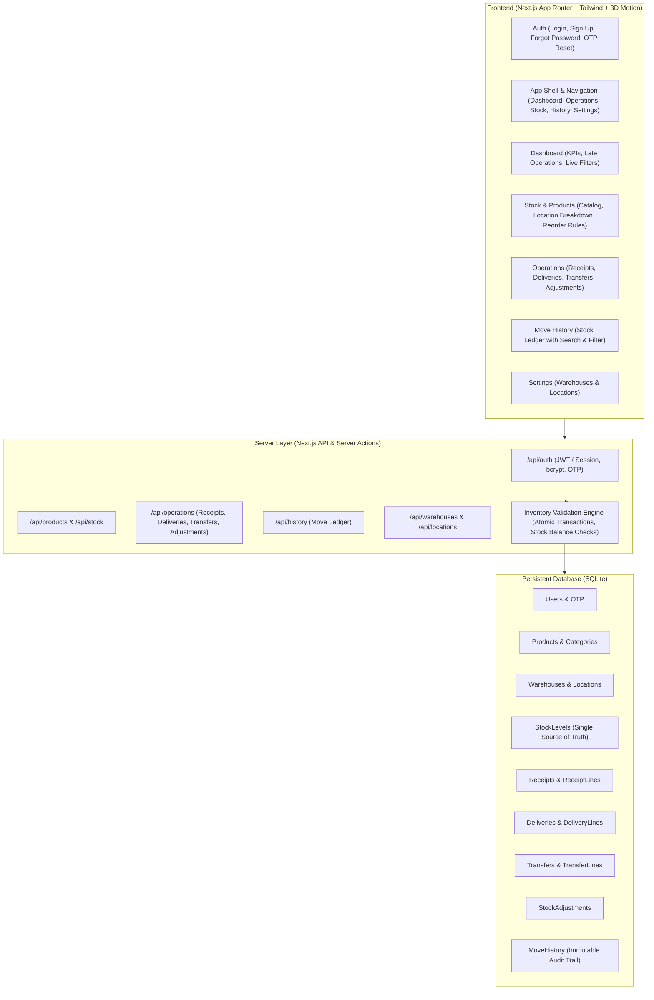

# StockSense — Complete Modular Inventory Management System (IMS)

Build the complete, functional, persistent Inventory Management System based strictly on the user requirements, the provided Excalidraw mockup diagram, and the brand color palette (warm cream & rich brown with 3D motion UI/UX).

## User Review Required

> [!IMPORTANT]
> - **Stack Selection**: We will build the system with **Next.js 14+ (App Router)**, **TypeScript**, **Tailwind CSS**, and **SQLite database** (persisted locally with relational schema, atomic operations, and foreign keys).
> - **Brand Aesthetics**: The design strictly uses the brand color palette extracted from the StockSense logo:
>   - Background: Cream `#FDF6EC` / `#F8EFE4` / Warm parchment `#F1E3D3`
>   - Primary & Accents: Rich wood brown `#3D271D`, roasted coffee `#5A3825`, warm caramel `#8C5835`, golden sand `#D8A46B`
>   - 3D Motion UI/UX: Perspective 3D card tilt, elevated layers, smooth spring transitions, 3D warehouse isometric visuals, and status badges.
> - **Zero Mockups / Full Functionality**: Every single button, form, filter, search, status workflow, and ledger movement will be fully wired to real persistent database state.

---

## Architecture & Data Flow

---

## Core Entities & Inventory Engine Logic

1. **Receipts (`WH/IN/XXXXX`)**:
   - `Draft` $\rightarrow$ `Ready` $\rightarrow$ `Done`.
   - On Validation: `StockLevel(product, destinationLocation) += qty`. Log to `MoveHistory` (`type: 'Receipt'`).
2. **Deliveries (`WH/OUT/XXXXX`)**:
   - `Draft` $\rightarrow$ `Waiting` $\rightarrow$ `Ready` $\rightarrow$ `Done`.
   - On Validation: Atomic check `availableStock(product, sourceLocation) >= qty`. If insufficient, reject with clear error toast. Otherwise, `StockLevel(product, sourceLocation) -= qty`. Log to `MoveHistory` (`type: 'Delivery'`).
3. **Internal Transfers (`WH/INT/XXXXX`)**:
   - Source Location $\rightarrow$ Destination Location.
   - On Validation: Verify source stock. Decrement source, increment destination. Total stock across company remains constant. Log to `MoveHistory` (`type: 'Internal Transfer'`).
4. **Stock Adjustments (`WH/ADJ/XXXXX`)**:
   - Compares `recordedQuantity` vs `countedQuantity`.
   - Calculates difference $\Delta$.
   - On Validation: Sets `StockLevel(product, location) = countedQuantity`. Log $\Delta$ to `MoveHistory` (`type: 'Adjustment'`).
5. **Move History (Stock Ledger)**:
   - Contains immutable records of all operations: Reference, Date, Product, Operation Type, From, To, Quantity, Status.

---

## Proposed Changes

### Configuration & Base Setup
#### [NEW] [package.json](file:///c:/Projects/StockSense/package.json)
Configure dependencies: `next`, `react`, `react-dom`, `lucide-react`, `bcryptjs`, `jsonwebtoken`, `better-sqlite3` (or pure JS SQLite engine), `clsx`, `tailwind-merge`.
#### [NEW] [tsconfig.json](file:///c:/Projects/StockSense/tsconfig.json)
TypeScript configuration with path aliases (`@/*`).
#### [NEW] [tailwind.config.js](file:///c:/Projects/StockSense/tailwind.config.js)
Extended theme with StockSense cream and brown color palette, 3D card tilt utilities, and custom shadows.
#### [NEW] [postcss.config.js](file:///c:/Projects/StockSense/postcss.config.js)
PostCSS configuration.

---

### Database & Backend Engine
#### [NEW] [src/lib/db.ts](file:///c:/Projects/StockSense/src/lib/db.ts)
SQLite persistent database connection, schema initialization (Users, Warehouses, Locations, Products, Categories, StockLevels, Receipts, Deliveries, Transfers, Adjustments, MoveHistory), migration runner, and atomic transaction helper.
#### [NEW] [src/lib/seed.ts](file:///c:/Projects/StockSense/src/lib/seed.ts)
Realistic seed data: Steel Rods, Chairs, Tables, Aluminum Sheets, Hydraulic Valves, Warehouses (Main, Secondary), Locations (Stock, Rack A, Rack B, Production), initial stock levels, demo receipts, deliveries, and move history, plus demo accounts (`admin@stocksense.com` / `password123`).
#### [NEW] [src/lib/auth.ts](file:///c:/Projects/StockSense/src/lib/auth.ts)
Password hashing with bcrypt, JWT token generation/verification, session cookie handling, and OTP generator.
#### [NEW] [src/lib/inventoryEngine.ts](file:///c:/Projects/StockSense/src/lib/inventoryEngine.ts)
Atomic inventory validation business logic:
- `validateReceipt(receiptId)`
- `validateDelivery(deliveryId)`
- `validateTransfer(transferId)`
- `validateAdjustment(adjustmentId)`
- Automatic reference number generator (`WH/IN/00001`, `WH/OUT/00001`, etc.)

---

### API Routes
#### [NEW] [src/app/api/auth/[...action]/route.ts](file:///c:/Projects/StockSense/src/app/api/auth/[...action]/route.ts)
Endpoints for `/login`, `/signup`, `/forgot-password`, `/reset-password`, `/me`, `/logout`.
#### [NEW] [src/app/api/products/route.ts](file:///c:/Projects/StockSense/src/app/api/products/route.ts)
Product CRUD, SKU uniqueness check, and stock availability breakdown.
#### [NEW] [src/app/api/warehouses/route.ts](file:///c:/Projects/StockSense/src/app/api/warehouses/route.ts)
Warehouse CRUD & Locations CRUD.
#### [NEW] [src/app/api/receipts/route.ts](file:///c:/Projects/StockSense/src/app/api/receipts/route.ts)
Receipts list, create, view, status update, validate.
#### [NEW] [src/app/api/deliveries/route.ts](file:///c:/Projects/StockSense/src/app/api/deliveries/route.ts)
Deliveries list, create, view, status update, validate (with stock availability check).
#### [NEW] [src/app/api/transfers/route.ts](file:///c:/Projects/StockSense/src/app/api/transfers/route.ts)
Internal transfers list, create, validate.
#### [NEW] [src/app/api/adjustments/route.ts](file:///c:/Projects/StockSense/src/app/api/adjustments/route.ts)
Inventory adjustments list, create, validate.
#### [NEW] [src/app/api/history/route.ts](file:///c:/Projects/StockSense/src/app/api/history/route.ts)
Move history / stock ledger querying with filters.
#### [NEW] [src/app/api/dashboard/route.ts](file:///c:/Projects/StockSense/src/app/api/dashboard/route.ts)
Aggregated dashboard KPIs, late receipts/deliveries, scheduled transfers, low stock alerts, and dynamic filtering.

---

### UI Components & Application Shell
#### [NEW] [src/components/layout/Navbar.tsx](file:///c:/Projects/StockSense/src/components/layout/Navbar.tsx)
Top navigation matching the mockup diagram:
- StockSense logo + wordmark
- Dashboard
- Operations dropdown (Receipts, Delivery Orders, Inventory Adjustments, Internal Transfers)
- Stock
- Move History
- Settings dropdown (Warehouses, Locations)
- User profile menu + Logout
#### [NEW] [src/components/ui/Toast.tsx](file:///c:/Projects/StockSense/src/components/ui/Toast.tsx)
Real-time feedback snackbar/toast for actions and error notifications.
#### [NEW] [src/components/ui/Badge.tsx](file:///c:/Projects/StockSense/src/components/ui/Badge.tsx)
Badges for Draft, Waiting, Ready, Done, Canceled, Low Stock, Out of Stock.
#### [NEW] [src/components/ui/3DCard.tsx](file:///c:/Projects/StockSense/src/components/ui/3DCard.tsx)
Interactive 3D tilt card component with specular lighting reflection and soft cream/brown shadows.
#### [NEW] [src/components/ui/Modal.tsx](file:///c:/Projects/StockSense/src/components/ui/Modal.tsx)
Accessible modal dialog with animations for creating products, warehouses, locations, and adjustments.

---

### Pages & User Flows
#### [NEW] [src/app/login/page.tsx](file:///c:/Projects/StockSense/src/app/login/page.tsx)
Login screen matching mockup with logo, credentials, quick demo login buttons, and forgot password link.
#### [NEW] [src/app/signup/page.tsx](file:///c:/Projects/StockSense/src/app/signup/page.tsx)
Signup screen with full name, email, password, and confirmation.
#### [NEW] [src/app/forgot-password/page.tsx](file:///c:/Projects/StockSense/src/app/forgot-password/page.tsx)
Request password reset OTP code.
#### [NEW] [src/app/reset-password/page.tsx](file:///c:/Projects/StockSense/src/app/reset-password/page.tsx)
Enter OTP code and set new password.
#### [NEW] [src/app/dashboard/page.tsx](file:///c:/Projects/StockSense/src/app/dashboard/page.tsx)
Dashboard landing page matching mockup:
- Receipt operational card (X To Receive, Late, Operations)
- Delivery operational card (X To Deliver, Late, Waiting, Operations)
- Internal Transfer card
- KPI summary (Products in stock, Low/Out of Stock, Pending Receipts, Pending Deliveries)
- Dynamic multi-criteria filter (Document Type, Status, Warehouse/Location)
- Recent movements feed
#### [NEW] [src/app/stock/page.tsx](file:///c:/Projects/StockSense/src/app/stock/page.tsx)
Stock view matching mockup:
- Product list with SKU, Category, On Hand, Free to Use, Unit of Measure
- Location breakdown per product (e.g., Main Warehouse: 500 kg, Production Rack: 100 kg)
- Search by SKU / Name, category filter, low stock toggle
- "Create Product" and "Edit Product" modals
#### [NEW] [src/app/operations/receipts/page.tsx](file:///c:/Projects/StockSense/src/app/operations/receipts/page.tsx)
Receipts list page matching mockup with search, list/card view toggle, status filter, and "+ New Receipt" button.
#### [NEW] [src/app/operations/receipts/[id]/page.tsx](file:///c:/Projects/StockSense/src/app/operations/receipts/[id]/page.tsx)
Receipt form matching mockup:
- Reference e.g. `WH/IN/00001`
- Supplier, Destination Location, Scheduled Date
- Status workflow breadcrumbs: `Draft` $\rightarrow$ `Ready` $\rightarrow$ `Done`
- Actions: `Validate`, `Print`, `Cancel`
- Line items table: Product selection, quantity, add/remove line
#### [NEW] [src/app/operations/deliveries/page.tsx](file:///c:/Projects/StockSense/src/app/operations/deliveries/page.tsx)
Deliveries list page matching mockup with search, filters, and "+ New Delivery" button.
#### [NEW] [src/app/operations/deliveries/[id]/page.tsx](file:///c:/Projects/StockSense/src/app/operations/deliveries/[id]/page.tsx)
Delivery form matching mockup:
- Reference e.g. `WH/OUT/00001`
- Customer / Delivery Address, Source Location, Scheduled Date
- Status workflow breadcrumbs: `Draft` $\rightarrow$ `Waiting` $\rightarrow$ `Ready` $\rightarrow$ `Done`
- Actions: `Validate`, `Print`, `Cancel`
- Line items table with available stock indicator
- Clear error feedback if stock is insufficient
#### [NEW] [src/app/operations/transfers/page.tsx](file:///c:/Projects/StockSense/src/app/operations/transfers/page.tsx)
Internal transfers list and create form (Source Location $\rightarrow$ Destination Location).
#### [NEW] [src/app/operations/adjustments/page.tsx](file:///c:/Projects/StockSense/src/app/operations/adjustments/page.tsx)
Stock adjustments page: select product & location, view recorded quantity, enter counted quantity, view auto-calculated difference, validate.
#### [NEW] [src/app/move-history/page.tsx](file:///c:/Projects/StockSense/src/app/move-history/page.tsx)
Move History / Stock Ledger page matching mockup:
- Columns: Reference, Date, Product, Operation, From, To, Quantity, Status
- Search and filtering by operation type and status
#### [NEW] [src/app/settings/warehouse/page.tsx](file:///c:/Projects/StockSense/src/app/settings/warehouse/page.tsx)
Warehouse management page matching mockup (Name, Short Code, Address).
#### [NEW] [src/app/settings/location/page.tsx](file:///c:/Projects/StockSense/src/app/settings/location/page.tsx)
Location management page matching mockup (Name, Short Code, Warehouse dropdown).
#### [NEW] [src/app/profile/page.tsx](file:///c:/Projects/StockSense/src/app/profile/page.tsx)
My Profile view, user credentials, change password, and logout button.

---

## Verification Plan

### Automated & End-to-End Workflow Tests
We will execute tests to verify all 10 user-specified scenarios:
1. **TEST 1 — Authentication**: Sign up $\rightarrow$ Login $\rightarrow$ Access protected dashboard $\rightarrow$ Logout $\rightarrow$ Verify unauthenticated redirect.
2. **TEST 2 — Product Creation & Search**: Create product "Steel Rods" with SKU `STL-001` $\rightarrow$ Verify in list $\rightarrow$ Search by SKU $\rightarrow$ Update details.
3. **TEST 3 — Receipt Validation**: Create receipt for 50 units $\rightarrow$ Save as Draft $\rightarrow$ Validate $\rightarrow$ Verify stock increases by 50 $\rightarrow$ Verify Move History contains entry.
4. **TEST 4 — Internal Transfer**: Transfer 20 units from Main Warehouse to Production Rack $\rightarrow$ Verify source stock decreases by 20, destination increases by 20, total inventory remains constant $\rightarrow$ Verify Move History contains transfer.
5. **TEST 5 — Delivery Order**: Create delivery for 10 units $\rightarrow$ Validate $\rightarrow$ Verify stock decreases by 10 $\rightarrow$ Verify Move History contains delivery.
6. **TEST 6 — Stock Adjustment**: Recorded = 40, Counted = 37 $\rightarrow$ Validate $\rightarrow$ Verify stock becomes 37 $\rightarrow$ Verify Move History logs -3 difference.
7. **TEST 7 — Invalid Delivery Rejection**: Attempt to deliver more than available stock $\rightarrow$ Verify operation is rejected with user-friendly error $\rightarrow$ Stock remains unchanged.
8. **TEST 8 — Dashboard Real-time Calculation**: Verify KPIs (Total products in stock, Low stock, Pending receipts, Pending deliveries) derive directly from database state.
9. **TEST 9 — Dynamic Filters**: Filter by document type, status, warehouse/location $\rightarrow$ Verify displayed data dynamically changes.
10. **TEST 10 — Persistence Check**: Verify SQLite database file `stocksense.db` persists state across restarts.
